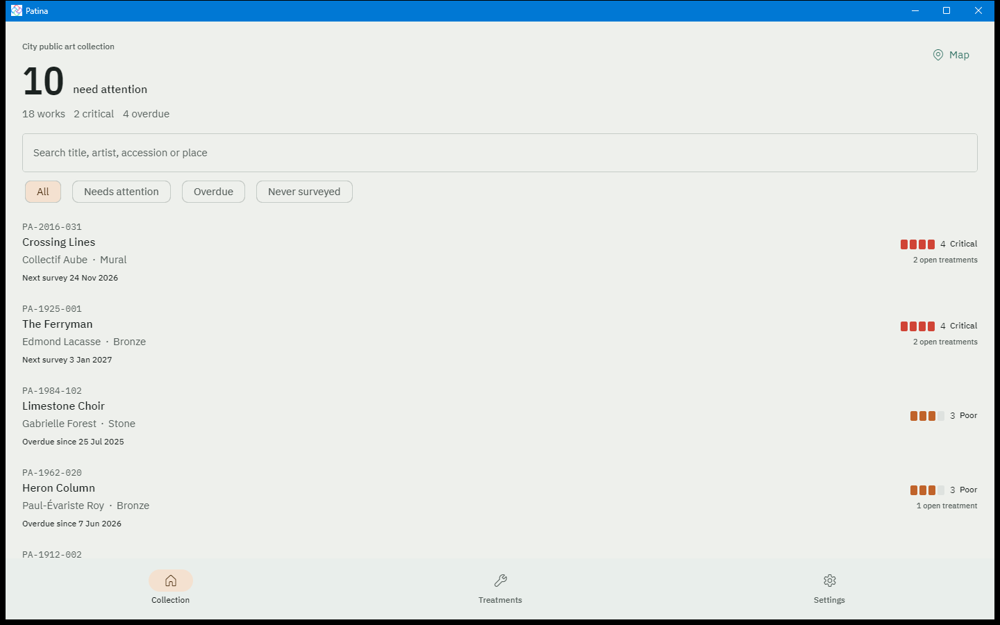
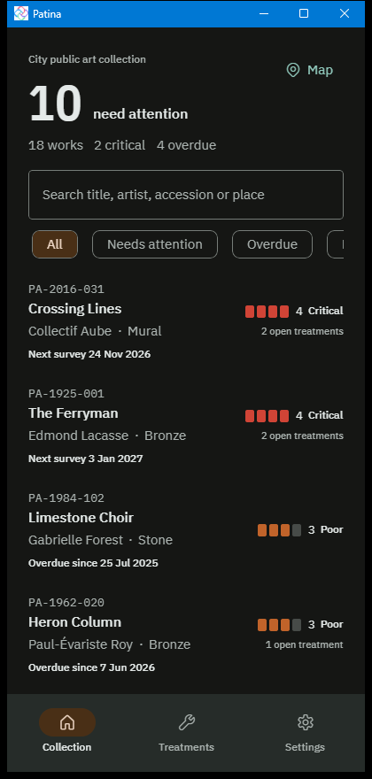
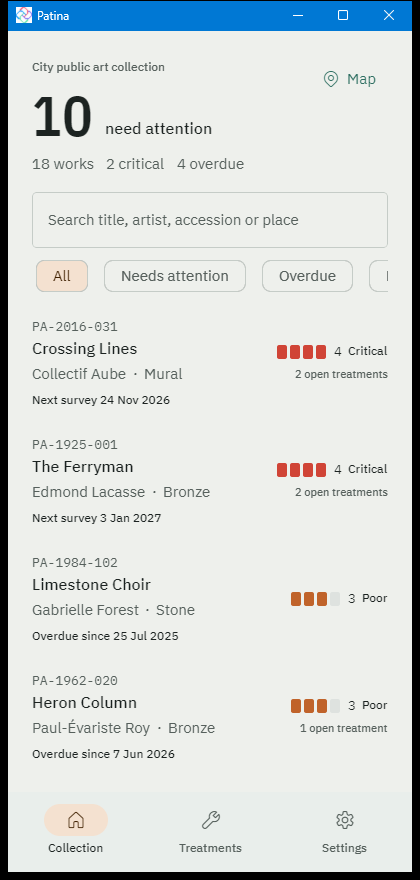
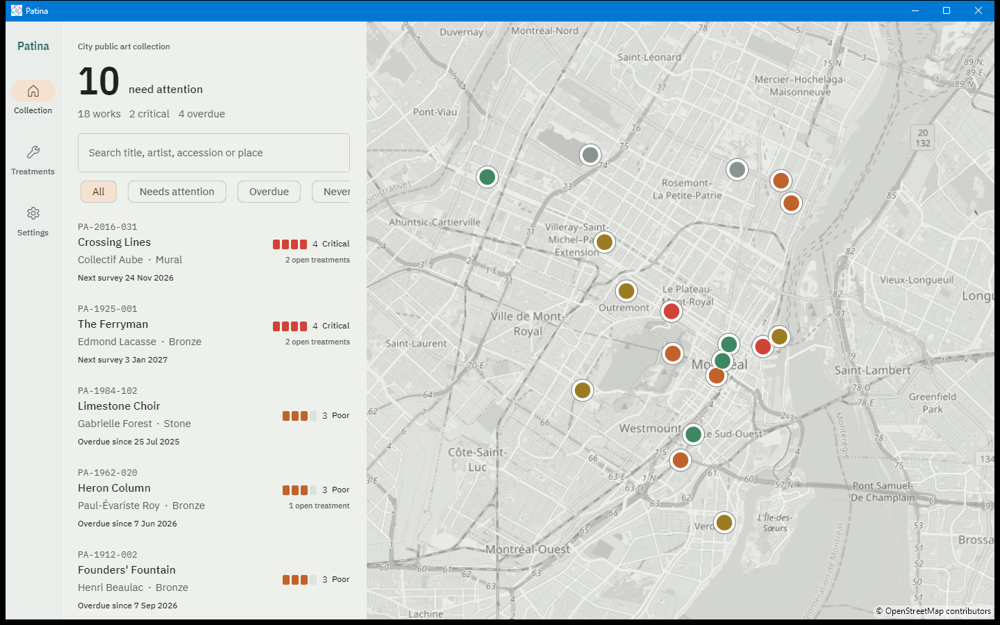

# Evidence: ResponsiveExtension does not reconnect after Unloaded

- Session: f90a1d6b-7589-4665-aac2-1dfba9bfc389 (Claude Code), 2026-10-03
- Versions: Uno.Sdk 6.7.30, Uno.Toolkit.WinUI 9.1.3, Uno.Extensions 7.3.6, .NET SDK 10.0.303, `net10.0-desktop`, Windows 11
- Driver: `tools/Drive.ps1` (Win32 resize via `SetWindowPos`, twice per resize) and `tools/Capture-Window.ps1` (PrintWindow)

## Symptom

After visiting a detail page and returning, `{utu:Responsive}` values on the cached main shell and Collection page
stopped reacting to window size: at 1440 px the app kept the phone layout (bottom tab bar, no map), and at 420 px it
kept the wide layout (rail and map visible, list clipped).

## Isolation (in order)

1. Fresh launch, shrink 1024 → 420: layout switched correctly (bottom bar, Map button).
   
2. Grow to 1440 and shrink to 420 again without navigating: switched correctly both ways.
3. Runtime theme switch (Settings > Light), then shrink: still correct, so the theme service is not involved.
4. Open an artwork (shell-level route that replaces `MainPage` in the shell frame), press Back, grow to 1440:
   **froze** (screenshot above). Reproduced on every attempt.

## Cause (source read, not traced at runtime)

`src/Uno.Toolkit.UI/Markup/ResponsiveExtension.cs` on branch `release/stable/9.1`:

- `OnTargetLoaded` clears `_disposable` (which held the `Loaded` subscription) and calls `Connect`.
- `Connect` subscribes to `ResponsiveHelper.WindowSizeChanged` and to the host's `Unloaded`.
- `OnHostUnloaded` calls `CleanupIfHostDisposed(force: true)` and `Disconnect()`.
- Nothing re-subscribes `Loaded`, so when the cached page re-enters the tree the extension stays disconnected.

## Fix that held

`AdaptiveTrigger` visual states on the three cached pages (`MainPage`, `CollectionPage`, `SettingsPage`), marked
`WORKAROUND(ResponsiveExtension does not reconnect after Unloaded)`. Same sequence after the change: artwork → back →
420 px and → 1440 px both switch correctly.

## Not established

- Not reduced to a minimal page outside Patina; not tested on WebAssembly or Android after back navigation.
- Not filed upstream (unoplatform/uno.toolkit.ui).
